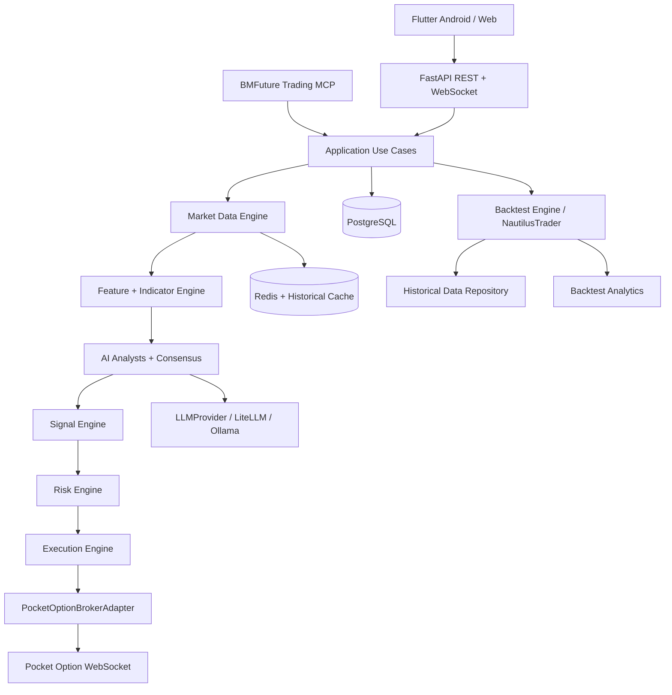
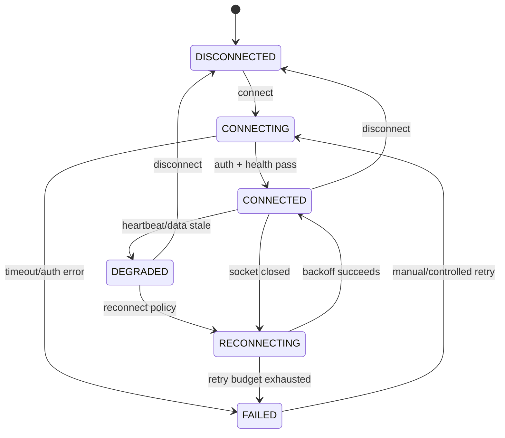
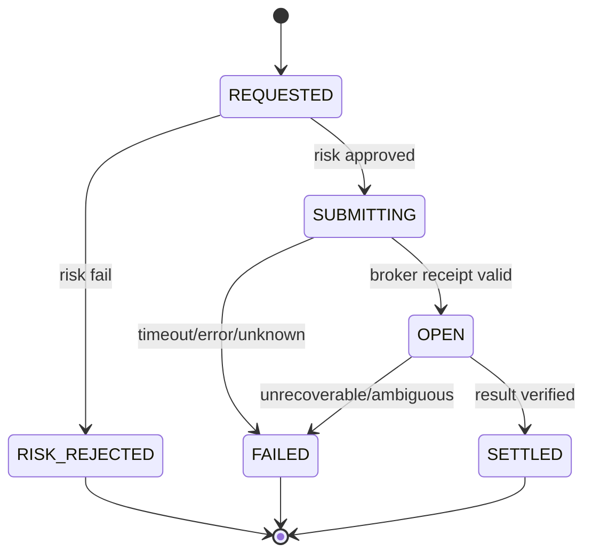

# BM Future PO AutoTrade AI — Architecture

Status: **Implemented safety/AI/market boundary + SQLite journal/statistics — full historical adapter pending**  
Dokumen ini tetap menjadi kontrak teknis; source vertical slice sekarang mencakup broker health, market normalization, indicators, LiteLLM/Ollama boundary, consensus, risk, execution, Auto Trade lifecycle, MCP read-only facade, serta persistence journal/statistics.

## 1. Tujuan dan keputusan utama

BM Future PO AutoTrade AI adalah sistem monorepo untuk Android, Flutter Web, backend trading, analisis AI, backtest, MCP, jurnal, dan statistik. Sistem dirancang untuk Pocket Option melalui adapter modular karena konektor yang tersedia bersifat tidak resmi.

Keputusan yang mengikat:

1. **Hanya dua `AccountMode`: `DEMO` dan `REAL`.** Tidak ada Paper Account, Paper Balance, Virtual Account, atau Simulated Live Trading.
2. **`DEMO` adalah default awal.** Semua state broker, saldo, session, histori, cache, sinyal, trade, dan jurnal harus terikat pada `account_id` serta `account_mode`.
3. **AI tidak memiliki hak eksekusi.** AI hanya menghasilkan analisis terstruktur. Keputusan akhir berada pada `AIConsensusEngine`, `RiskEngine`, lalu `ExecutionEngine`.
4. **UI tidak mengenal library Pocket Option.** UI hanya memanggil API/WebSocket backend. Hanya `PocketOptionBrokerAdapter` yang boleh mengetahui detail library broker.
5. **Execution fail-closed.** Data basi, balance tidak tersedia, koneksi tidak sehat, output AI tidak valid, payout berubah, pair tutup, atau hasil trade tidak pasti berarti tidak ada entry baru.
6. **Backtest adalah jalur riset terpisah.** Backtest memakai historical data dan NautilusTrader; backtest tidak mengirim order serta bukan mode akun.
7. **Semua nominal keuangan menggunakan `Decimal`.** Semua timestamp internal menggunakan UTC dan disimpan sebagai timezone-aware timestamp.
8. **Server adalah sumber kebenaran.** Frontend tidak boleh memutuskan mode akun, kelayakan risiko, expiry sinyal, atau izin backtest sendiri.
9. **Tidak ada Martingale.** Nominal entry tidak boleh otomatis digandakan atau dinaikkan karena loss.
10. **Credential tidak pernah masuk Git, log, response API, screenshot diagnostik, atau database plaintext.**

## 2. Batas ruang lingkup

### Termasuk

- koneksi Pocket Option DEMO/REAL melalui adapter;
- data tick dan candle realtime melalui WebSocket;
- cache historical data;
- indikator teknikal dan feature engine;
- dua AI analyst, LLM gateway, consensus, signal engine;
- risk gate, execution lifecycle, auto trade, emergency stop;
- backtest berbasis NautilusTrader dengan gate DEMO;
- REST API, WebSocket API, dan MCP server;
- Flutter Android dan Flutter Web dengan satu codebase utama;
- jurnal trade, statistik, audit log, health monitoring, dan test suite;
- Docker Compose untuk dependency lokal serta deployment backend.

### Tidak termasuk

- menjamin profit atau memberikan rekomendasi investasi;
- scraping atau pemalsuan data broker;
- menyimpan SSID, cookie, password, token, atau API key dalam source code;
- raw broker call dari MCP, AI, UI, atau script ad-hoc;
- paper trading atau saldo virtual;
- automated test yang menggunakan akun REAL atau menempatkan order REAL;
- menganggap output LLM sebagai fakta market tanpa validasi terhadap `MarketDataSnapshot`.

## 3. Gambaran sistem



Jalur live dan jalur backtest berbagi kontrak domain serta feature/strategy interface, tetapi tidak berbagi execution path. `BacktestEngine` tidak menerima `ExecutionEngine` live dan tidak pernah memanggil `BrokerAdapter.place_call()` atau `place_put()`.

## 4. Komponen dan tanggung jawab

| Komponen | Tanggung jawab | Tidak boleh dilakukan |
| --- | --- | --- |
| Flutter App | Menampilkan state server, mengirim command terotorisasi, chart, dashboard, jurnal, dan setting | Menghitung izin risiko final atau memanggil broker langsung |
| API Layer | Auth, validasi request, routing use case, response schema, rate limit | Menaruh logic trading di route handler |
| Application Layer | Orkestrasi command/query lintas domain | Mengakses detail WebSocket Pocket Option secara langsung |
| Broker Adapter | Lifecycle koneksi, normalisasi request/response broker, subscribe data, order call/put | Mengambil keputusan AI/risk |
| Market Data Engine | Validasi, normalisasi, deduplikasi, cache, freshness, candle aggregation | Mengarang tick/candle/payout |
| Feature Engine | Indikator dan fitur deterministik dari data market | Mengambil data broker secara langsung |
| AI Analysts | Menganalisis snapshot fitur yang diberikan dan mengembalikan JSON | Menempatkan order atau mengisi data market yang hilang |
| Consensus Engine | Validasi dan menggabungkan output dua analyst | Melewati Risk Engine |
| Signal Engine | Membuat dan meng-expire signal, ranking scanner | Menganggap signal lama masih valid |
| Risk Engine | Memeriksa semua batas risiko dan mengeluarkan APPROVED/REJECTED | Mengubah nominal berdasarkan loss |
| Execution Engine | Idempotency, submit order, monitor result, state transition | Entry saat health check gagal |
| Journal/Analytics | Menyimpan fakta transaksi dan metrik | Mengubah hasil broker tanpa audit |
| Backtest Engine | Menjalankan historical simulation dan metrik | Menggunakan akun live atau mengirim order |
| MCP Server | Menyediakan tool analisis/query/backtest melalui use case | Raw broker call dan tool `place_trade` |
| Database | Durability, query, audit, migration | Menyimpan secret plaintext |

## 5. Model domain inti

### 5.1 Enum yang dibakukan

```text
AccountMode       = DEMO | REAL
ConnectionStatus  = DISCONNECTED | CONNECTING | CONNECTED | DEGRADED | RECONNECTING | FAILED
Direction         = CALL | PUT | WAIT
Decision           = APPROVE | REJECT
TradeResult       = WIN | LOSS | DRAW | OPEN | UNKNOWN
SignalStatus      = STRONG_CALL | CALL | WAIT | PUT | STRONG_PUT | EXPIRED | INVALID
RiskDecision      = APPROVED | REJECTED
OrderLifecycle    = REQUESTED | RISK_REJECTED | SUBMITTING | OPEN | SETTLED | FAILED | CANCELLED
```

### 5.2 `AccountContext`

Setiap operasi broker menerima context immutable berikut secara konseptual:

```text
AccountContext {
  account_id: UUID
  mode: DEMO | REAL
  broker: "pocket_option"
  credential_ref: secret-store reference | null
  server_region: string | null
  created_at: UTC timestamp
}
```

`credential_ref` hanya menunjuk ke secret manager/OS secure storage. Nilai credential tidak boleh dikembalikan oleh API atau logger.

### 5.3 Kontrak `BrokerAdapter`

Adapter harus mengekspos kontrak async yang stabil berikut. Nama method publik tidak bergantung pada nama method library referensi.

| Method | Output normalisasi |
| --- | --- |
| `connect()` | `ConnectionSnapshot` |
| `disconnect()` | `None` dan idempotent |
| `reconnect()` | `ConnectionSnapshot` |
| `get_balance()` | `MoneySnapshot` dengan `account_id` dan `mode` |
| `get_account_type()` | `AccountMode` yang sudah diverifikasi |
| `get_pairs()` | `list[PairSnapshot]` |
| `get_payout(pair)` | `PayoutSnapshot` atau `Unavailable` |
| `get_history(pair, period, start, end)` | canonical historical candles/ticks |
| `get_ticks(pair)` | canonical tick list/snapshot |
| `get_candles(pair, timeframe, start, end)` | canonical OHLCV candles |
| `place_call(order)` | `BrokerOrderReceipt` |
| `place_put(order)` | `BrokerOrderReceipt` |
| `check_trade_result(trade_id)` | `TradeSettlement` atau `Pending` |
| `get_open_trades()` | list trade dalam context yang sama |
| `get_trade_history()` | list trade dalam context yang sama |

Kontrak tambahan wajib:

- method tidak boleh memakai mutable global mode;
- semua result membawa `account_id`, `mode`, `broker_timestamp`, dan `received_at` bila relevan;
- error broker dikonversi ke error domain yang stabil;
- timeout setiap call memiliki batas konfigurasi;
- `place_call`/`place_put` membutuhkan `idempotency_key` dari Execution Engine;
- adapter menolak order jika context tidak cocok dengan session aktif.

### 5.4 Kontrak market data

```text
MarketTick {
  pair: string
  market_kind: OTC | REGULAR | UNKNOWN
  bid: Decimal | null
  ask: Decimal | null
  price: Decimal
  broker_time: UTC timestamp
  received_at: UTC timestamp
  source: string
  sequence: int | null
}

MarketCandle {
  pair: string
  timeframe_seconds: int
  open_time: UTC timestamp
  close_time: UTC timestamp
  open: Decimal
  high: Decimal
  low: Decimal
  close: Decimal
  volume: Decimal | null
  source: string
}
```

Data diterima hanya jika harga valid, timestamp dapat diparse, `high >= max(open, close)`, `low <= min(open, close)`, dan urutan candle tidak melanggar kontrak timeframe. Data invalid disimpan sebagai diagnostic event, bukan sebagai input AI atau execution.

## 6. Isolasi DEMO dan REAL

Mode akun bukan sekadar label UI. Isolasi diterapkan di lima lapisan:

1. **Configuration:** `BROKER_DEMO_*` dan `BROKER_REAL_*` terpisah; tidak ada fallback REAL ke credential DEMO atau sebaliknya.
2. **Runtime:** satu `BrokerSession` hanya boleh memiliki satu `AccountMode`; registry memakai key `(broker, account_id, mode)`.
3. **Persistence:** tabel transaksi, saldo, cache, signal, dan jurnal selalu memiliki `account_id` serta `account_mode`; query repository wajib menerima scope.
4. **API:** mode dikembalikan server dan diverifikasi pada setiap command sensitif. Client tidak boleh memaksa response menjadi mode lain.
5. **UI:** REAL memakai warna/peringatan khusus; perubahan mode memutus atau mengisolasi session lama, melakukan health check ulang, dan me-reset data view yang tidak cocok.

Aturan tambahan:

- aplikasi pertama kali selalu memilih DEMO;
- mode REAL harus di-unlock oleh aksi eksplisit pengguna dan status `real_trading_armed` yang memiliki expiry;
- automated test hanya memakai DEMO fixture atau adapter fake;
- journal tidak boleh mencampurkan statistik DEMO dan REAL tanpa filter eksplisit;
- backtest hanya menerima `AccountContext.mode == DEMO` dan tidak membuat account mode baru.

## 7. Pocket Option adapter

### 7.1 Batas integrasi

`PocketOptionBrokerAdapter` adalah anti-corruption layer. Library `Mastaaa1987/PocketOptionAPI-v2` hanya ditempatkan di implementation boundary; application layer tidak boleh import library tersebut.

Mapping awal yang perlu diuji pada Phase 2:

| Kebutuhan domain | Referensi konektor | Catatan |
| --- | --- | --- |
| Connect | `connect()` | simpan thread/event loop milik adapter, bukan global |
| Balance | `GetBalance()` | normalisasi ke Decimal dan mode context |
| Pairs | `GetPairs()` | validasi shape dan status open |
| Trade | `Buy(amount, pair, action, expiration)` | dipanggil hanya oleh Execution Engine |
| Result | `CheckWin(id)` | normalisasi WIN/LOSS/DRAW/UNKNOWN |
| History | `GetHistory(pair)` / history method | simpan UTC dan source timestamp |
| Ticks | `GetTicks(pair)` | deduplikasi dan freshness check |
| WebSocket | konektor internal | adapter mengelola heartbeat/reconnect |

Jika versi library tidak menyediakan payout, pair status, candle, atau method tertentu secara konsisten, adapter mengembalikan `Unavailable` dan Risk Engine menolak entry. Tidak boleh mengisi nilai default yang terlihat seolah-olah berasal dari broker.

### 7.2 Lifecycle koneksi



Ketentuan:

- exponential backoff dengan jitter dan batas maksimum;
- heartbeat interval, read timeout, reconnect budget, dan stale threshold configurable;
- reconnect tidak boleh menggandakan listener atau thread;
- `disconnect()` idempotent dan membersihkan task/thread yang dibuat adapter;
- health monitor menerbitkan event `BrokerHealthChanged`;
- tidak ada SSID/session/auth token di exception message atau log;
- ketika socket mati, `ExecutionEngine` langsung memblokir entry baru.

## 8. Market Data Engine

Pipeline:

```text
Broker stream/history
  → transport parser
  → schema validation
  → UTC normalization
  → deduplication/order check
  → candle aggregation/cache
  → freshness monitor
  → MarketDataSnapshot
```

`MarketDataSnapshot` harus memuat `snapshot_id`, pair, timeframe, latest price, recent ticks/candles, payout, pair status, received time, source time, age, and validation status. AI hanya boleh menerima snapshot dengan `validation_status=VALID` dan age di bawah threshold.

Cache key minimal:

```text
market:{account_mode}:{account_id}:{pair}:{timeframe}
```

Cache tidak boleh menyeberangkan data DEMO ke REAL. Historical data yang sumbernya sama boleh dipakai ulang hanya jika metadata source, pair, timeframe, dan time range tetap dapat diaudit; account mode tetap menjadi scope request backtest.

## 9. Feature dan Indicator Engine

Feature Engine bersifat deterministik dan tidak bergantung pada LLM. Implementasi awal:

- EMA, SMA;
- RSI;
- MACD;
- Bollinger Bands;
- Stochastic;
- ADX;
- ATR;
- trend, momentum, volatility, support/resistance, candle structure;
- multi-timeframe alignment;
- historical similarity dan anomaly flags.

Setiap feature menyimpan window, timeframe, source candle range, kalkulasi version, dan status data cukup/tidak cukup. Jika data tidak cukup, nilai feature adalah `null` dengan alasan; jangan membuat angka sintetis.

## 10. AI Architecture

### 10.1 Jalur keputusan

```text
MARKET DATA
  → FEATURE ENGINE
  → AI ANALYST 1 + AI ANALYST 2
  → AI CONSENSUS ENGINE
  → SIGNAL ENGINE
  → RISK ENGINE
  → EXECUTION ENGINE
  → POCKET OPTION ADAPTER
```

AI Analyst 1 fokus pada indikator teknikal, trend, momentum, volatility, support/resistance, candlestick, dan price action.

AI Analyst 2 fokus pada pattern recognition, multi-timeframe analysis, historical similarity, market structure, confidence verification, dan anomaly detection.

### 10.2 `LLMProvider`

Semua provider diakses melalui satu abstraction:

```text
LLMProvider
  - complete(request: LLMRequest) -> LLMResponse
  - health_check() -> ProviderHealth
  - list_models() -> list[ModelInfo]
```

Implementasi provider awal:

- `LiteLLMProvider` untuk OpenAI, Anthropic, dan provider LiteLLM lain;
- `OllamaProvider` atau LiteLLM route ke `http://localhost:11434` sebagai local optional runtime.

Konfigurasi:

```text
AI_PROVIDER=openai|anthropic|ollama
AI_MODEL=<configured model name>
AI_TEMPERATURE=<configured decimal>
AI_TIMEOUT_SECONDS=<configured integer>
AI_FALLBACK_PROVIDER=<optional provider>
AI_FALLBACK_MODEL=<optional model>
OLLAMA_BASE_URL=http://localhost:11434
```

Fallback hanya digunakan jika provider utama gagal dan provider fallback lolos health check. Jika semua provider gagal, timeout, mengembalikan JSON invalid, atau mengembalikan data tidak lengkap, hasil consensus adalah `WAIT`/`REJECT` dan tidak ada entry.

### 10.3 Kontrak output AI

Output analyst boleh memiliki field internal tambahan, tetapi output consensus publik harus sesuai schema versioned berikut:

```json
{
  "schema_version": "1.0",
  "pair": "EURUSD_otc",
  "direction": "CALL",
  "expiration": 60,
  "confidence": 82,
  "market_regime": "TRENDING",
  "risk": "MEDIUM",
  "reason": ["EMA alignment", "RSI supports momentum"],
  "indicators": {
    "rsi": 61.4,
    "macd": 0.00012,
    "ema_fast": 1.0842,
    "ema_slow": 1.0838,
    "bollinger_position": 0.72,
    "adx": 24.1,
    "atr": 0.00031,
    "stochastic": 68.2
  },
  "analyst_1_confidence": 84,
  "analyst_2_confidence": 80,
  "consensus_count": 2,
  "decision": "APPROVE",
  "source_snapshot_id": "uuid",
  "generated_at": "UTC timestamp",
  "expires_at": "UTC timestamp"
}
```

Validasi wajib:

- `direction` hanya `CALL`, `PUT`, atau `WAIT`;
- `confidence` dan confidence analyst 0–100;
- `expiration` berada dalam expiration yang didukung pair;
- `pair` sama dengan snapshot yang dikirim;
- `source_snapshot_id` ada dan masih valid;
- angka indikator berasal dari feature payload atau diberi `null`, bukan karangan model;
- `decision=APPROVE` hanya boleh jika dua analyst valid, threshold consensus terpenuhi, dan tidak ada anomaly/blocking flag;
- JSON parse/schema failure menghasilkan `WAIT`/`REJECT`, tidak ada partial execution.

Prompt harus memberitahukan bahwa market data adalah input tidak tepercaya bagi model dan model dilarang mengubah angka, menambah harga, atau mengeluarkan instruksi broker.

### 10.4 Consensus

Consensus Engine memakai policy deterministik yang dapat dikonfigurasi:

- minimum analyst count: 2;
- minimum confidence keseluruhan;
- minimum confidence masing-masing analyst;
- consensus threshold, misalnya 2/2 atau policy yang disetujui;
- direction harus sama untuk `APPROVE`;
- disagreement → `WAIT`;
- anomaly atau stale data → `WAIT`;
- payout di bawah minimum → `WAIT`;
- snapshot mismatch → `REJECT`.

LLM tidak boleh memanggil fungsi `place_call`, `place_put`, `buy`, atau method broker apa pun.

## 11. Signal Engine dan Market Scanner

Signal memiliki:

```text
signal_id, account_id, account_mode, pair, direction,
confidence, payout, expiration_seconds, created_at,
expires_at, source_snapshot_id, consensus_count,
status, score, reasons
```

Signal status berubah menjadi `EXPIRED` secara server-side pada `expires_at`. Signal expired tidak boleh dikirim ke Execution Engine walaupun frontend belum refresh.

`ANALYZE ALL MARKETS` hanya memindai pair yang:

1. status broker `OPEN`;
2. payout tersedia dan memenuhi minimum;
3. historical data cukup;
4. market snapshot valid dan fresh;
5. tidak diblokir health/risk policy.

Ranking minimum: pair, direction, confidence, payout, trend, expiration, consensus, score, dan alasan eliminasi. Auto Trade hanya menerima kandidat paling tinggi yang masih fresh saat Risk Engine melakukan re-check.

## 12. Risk Engine

Risk Engine adalah otoritas final sebelum submit broker. Outputnya selalu:

```text
RiskDecision {
  decision: APPROVED | REJECTED
  reasons: list[RiskReason]
  checked_at: UTC timestamp
  policy_version: string
}
```

Pemeriksaan wajib:

| Pemeriksaan | Reject jika |
| --- | --- |
| Account mode | context tidak sesuai session/order |
| Balance | unavailable, stale, atau amount tidak valid |
| Pair | closed, unknown, atau tidak didukung |
| Payout | unavailable atau di bawah minimum |
| AI confidence | di bawah threshold atau consensus tidak lengkap |
| Signal age | sudah expired atau melebihi max signal age |
| Simultaneous trades | batas maksimum tercapai |
| Stop Loss | loss session/day sudah mencapai batas |
| Target Profit | target profit session/day sudah tercapai; entry baru dihentikan |
| Daily loss | batas harian tercapai |
| Consecutive losses | cooldown/lockout policy aktif |
| Connection health | bukan `CONNECTED`/health pass |
| Data freshness | snapshot/candle/tick basi |
| Duplicate | idempotency key atau signal sudah pernah dieksekusi |
| Emergency stop | global atau mode-specific stop aktif |

Nominal entry berasal dari konfigurasi risk policy/manual setting dan tidak berubah otomatis setelah loss. Tidak ada multiplier Martingale, recovery bet, atau doubling.

Untuk Pocket Option, `Stop Loss` dan `Target Profit` pada fase awal didefinisikan sebagai **session/day guard terhadap realized P/L** yang menghentikan entry baru. Sistem tidak boleh mengklaim dapat menutup kontrak sebelum expiry jika broker adapter tidak menyediakan kemampuan tersebut.

## 13. Execution Engine

Execution Engine menerima hanya `ApprovedTradeIntent` dari Risk Engine. Alur normal:

```text
Signal fresh
  → re-fetch health/balance/payout/pair
  → risk decision
  → create idempotent trade intent
  → submit CALL/PUT through adapter
  → persist broker receipt
  → monitor result
  → settle journal/statistics
```

State machine:



Ketentuan:

- `WAIT` tidak pernah menjadi order;
- order direction dipetakan oleh Execution Engine, bukan string bebas dari AI;
- broker submit timeout menghasilkan `FAILED`/`UNKNOWN` dan memblokir asumsi sukses;
- hasil tidak pasti tidak boleh di-retry sebagai order baru tanpa rekonsiliasi;
- idempotency key mencegah duplicate submit saat reconnect/restart;
- journal mencatat latency dari `intent_created_at` sampai receipt/result;
- `EMERGENCY STOP` menghentikan scanner, membatalkan task entry yang menunggu, dan memblokir entry baru. Monitoring trade yang sudah open tetap berjalan bila koneksi tersedia.

## 14. Auto Trade lifecycle

`AutoTradeController` memiliki scope account mode dan state:

```text
STOPPED → STARTING → RUNNING → STOPPING → STOPPED
                         ↓
                    EMERGENCY_STOPPED
```

Saat `RUNNING`:

1. scanner mengambil market candidates;
2. feature engine membuat snapshot;
3. dua analyst dianalisis;
4. consensus membuat signal;
5. risk re-check dilakukan tepat sebelum entry;
6. execution mengirim satu order yang lolos;
7. result dimonitor dan dijurnal;
8. loop scan menunggu cooldown lalu mengulang.

Jika disconnect, stale data, AI failure, balance unavailable, pair closed, payout berubah, restart, atau emergency stop, controller masuk `STOPPING`/`EMERGENCY_STOPPED` dan tidak entry. Controller hanya kembali `RUNNING` setelah health checks lengkap lulus dan pengguna mengaktifkan kembali jika policy mengharuskannya.

## 15. Backtest Engine

### 15.1 Gate

`POST /api/v1/backtests/run` dan tool MCP `run_backtest` wajib memeriksa server-side:

```text
if account_context.mode != DEMO:
    reject(403, BACKTEST_DEMO_ONLY)
```

Frontend menonaktifkan menu pada REAL, tetapi itu hanya UX; backend gate tetap wajib. Tidak ada bypass melalui query parameter, header, atau MCP.

### 15.2 Isolasi eksekusi

Backtest menerima historical candles/ticks dari repository/cache, lalu memakai NautilusTrader sebagai fondasi deterministic event-driven simulation. Backtest memiliki `BacktestVenue`/execution model internal dan tidak menerima instance live broker adapter.

Backtest:

- tidak memakai balance live atau DEMO live;
- tidak mengirim order ke Pocket Option;
- tidak menulis ke tabel `trades` live;
- menulis hasil ke namespace `backtests` dan `backtest_trades`;
- dapat memakai strategy/feature interface yang sama dengan live;
- selalu menyimpan parameter, data source, strategy version, AI model, dan code/config hash agar hasil dapat direproduksi.

Backtest parameters:

- pair;
- OTC/Regular;
- start/end date;
- timeframe;
- expiration;
- strategy;
- minimum confidence;
- minimum payout;
- entry amount;
- indicators;
- AI model;
- AI consensus threshold.

Output:

- total trades, win, loss, draw, win rate;
- gross profit, gross loss, net result;
- maximum drawdown;
- consecutive wins/losses;
- profit factor, expectancy;
- pair/timeframe/strategy performance;
- AI confidence vs result;
- equity curve, win/loss distribution, hour statistics, full entry table.

Backtest AI mode harus eksplisit: `DISABLED`, `RECORDED_OUTPUT`, atau `REPLAYABLE_PROVIDER`. Live LLM call saat backtest hanya boleh jika user memilihnya dan seluruh output disimpan; default yang reproducible adalah recorded/replayable output. Backtest tidak boleh menyamarkan hasil model yang gagal sebagai signal.

## 16. MCP Server

`BMFuture Trading MCP Server` adalah facade terhadap application use cases. MCP tidak menyimpan business logic duplikat dan tidak mengakses repository/broker secara langsung.

Tools minimal:

| Tool | Kategori | Aturan |
| --- | --- | --- |
| `get_account_status` | query | wajib scope mode/account |
| `get_balance` | query | tidak mengungkap secret/session |
| `get_market_pairs` | query | hasil normalized |
| `get_market_snapshot` | query | health/freshness ikut response |
| `get_candles` | query | validasi range dan pair |
| `get_ticks` | query | validasi range dan pair |
| `get_payout` | query | `unavailable` jika broker tidak menyediakan |
| `calculate_indicators` | analysis | deterministik dari data valid |
| `scan_market` | analysis | tidak mengeksekusi order |
| `analyze_pair` | analysis | AI output tervalidasi |
| `compare_pairs` | analysis | tidak mengubah account state |
| `generate_signal` | analysis | menghasilkan signal, bukan order |
| `run_backtest` | research | DEMO gate dan isolated path |
| `get_backtest_result` | research | hanya hasil tersimpan |
| `get_trading_statistics` | query | filter mode wajib eksplisit |
| `get_journal` | query | filter dan pagination |
| `get_ai_health` | health | provider/model status tanpa key |

Tidak ada tool `place_trade`, `place_call`, `place_put`, `set_balance`, atau raw broker command. Jika kelak ada command trade melalui MCP, ia wajib melewati jalur application yang sama, approval policy, Risk Engine, dan execution audit; bukan raw broker call.

Transport awal:

- Streamable HTTP untuk deployment/service;
- stdio untuk local MCP host;
- logging stdio hanya ke stderr agar tidak merusak JSON-RPC;
- auth, allowlist tool, rate limit, dan account scope wajib sebelum expose di luar localhost.

## 17. REST dan WebSocket API

### 17.1 REST route groups

```text
/api/v1/health
/api/v1/accounts
/api/v1/accounts/{account_id}/connect
/api/v1/accounts/{account_id}/disconnect
/api/v1/accounts/{account_id}/balance
/api/v1/markets/pairs
/api/v1/markets/{pair}/snapshot
/api/v1/markets/{pair}/candles
/api/v1/markets/{pair}/ticks
/api/v1/markets/{pair}/payout
/api/v1/analysis/pairs/{pair}
/api/v1/markets/scan
/api/v1/signals
/api/v1/auto-trade/start
/api/v1/auto-trade/stop
/api/v1/auto-trade/emergency-stop
/api/v1/trades
/api/v1/journal
/api/v1/statistics
/api/v1/backtests
/api/v1/backtests/{backtest_id}
/api/v1/ai/health
/api/v1/ai/ollama/detect
/api/v1/ai/ollama/models
/api/v1/settings
/api/v1/logs
```

Route handler hanya melakukan auth/context/validation dan meneruskan use case. Response memakai schema versioned. Error response minimal memiliki `code`, `message`, `details`, `request_id`, dan `retryable`; tidak menampilkan credential atau raw broker payload sensitif.

### 17.2 WebSocket topics

```text
/ws/account/{account_id}
/ws/market/{pair}
/ws/signals
/ws/trades
/ws/health
/ws/journal
```

Event envelope:

```json
{
  "event_id": "uuid",
  "event_type": "market.tick|signal.created|trade.settled|health.changed",
  "schema_version": "1.0",
  "account_id": "uuid|null",
  "account_mode": "DEMO|REAL|null",
  "occurred_at": "UTC timestamp",
  "payload": {}
}
```

Server melakukan backpressure, heartbeat WebSocket, reconnect hint, dan resync snapshot setelah client reconnect. Client tidak boleh menganggap event yang terlewat sebagai state final tanpa meminta snapshot terbaru.

## 18. Database dan persistence

Database utama: PostgreSQL melalui async SQLAlchemy/driver yang sesuai dan Alembic untuk migration. Redis digunakan untuk ephemeral cache, pub/sub, distributed lock, dan rate limit; Redis bukan sumber kebenaran jurnal.

Tabel inti:

| Tabel | Isi minimum | Isolasi |
| --- | --- | --- |
| `accounts` | account metadata, broker, mode, status | unique broker/account/mode |
| `broker_sessions` | health, timestamps, secret reference, no raw secret | account + mode |
| `market_cache` | snapshot metadata dan freshness | account + mode + pair |
| `candles` | canonical OHLCV | source + pair + timeframe |
| `ticks` | optional retained ticks | source + pair + time |
| `signals` | signal lifecycle dan expiry | account + mode |
| `ai_analysis` | analyst/consensus JSON tervalidasi | account + mode + snapshot |
| `trades` | live DEMO/REAL trade lifecycle | account + mode |
| `journal` | immutable normalized trade record | account + mode |
| `backtests` | parameter/result metadata | request scope DEMO, research namespace |
| `backtest_trades` | historical simulated entries/results | backtest id |
| `strategies` | versioned strategy/config | global or owner scope |
| `settings` | non-secret settings | owner + mode where relevant |
| `system_logs` | structured operational events | redacted |

Index/constraint wajib:

- `account_mode` hanya enum DEMO/REAL;
- foreign key semua data live ke `accounts`;
- unique idempotency key pada live trade intent;
- unique candle `(source, pair, timeframe, open_time)`;
- journal settlement immutable setelah verified, koreksi memakai audit event;
- backtest table tidak punya foreign key yang dapat mengarah ke live order;
- semua created/updated timestamps timezone-aware UTC.

Credential handling:

- local development: `.env` untracked atau OS secret store;
- deployment: secret manager/orchestrator secret;
- DB hanya menyimpan `credential_ref`, metadata redacted, dan rotation timestamp;
- startup menolak konfigurasi secret yang masuk log atau file tracked.

## 19. Flutter Android/Web

Client web runnable saat ini berada di `apps/web_dashboard` sebagai vertical slice visual dan interaction. Ia memakai fixture lokal untuk market preview, sementara health/balance/AI/Auto Trade serta settled journal/statistics dibaca melalui REST backend bila dikonfigurasi. Target production tetap Flutter Android/Web satu codebase seperti bagian berikut.

### 19.1 Navigasi

Android bottom navigation:

```text
Dashboard | Market | Signals | Trade | More
```

Web memakai sidebar dengan item yang sama. `More` memuat Auto Trade, Backtest, Journal, Statistics, AI Engine, Strategies, Connection, Settings, dan Logs.

### 19.2 Feature modules

```text
dashboard, market, signals, trade, auto_trade, backtest,
journal, statistics, ai_engine, strategies, connection, settings, logs
```

Setiap feature memiliki page, state/controller, repository client, model DTO, dan widget. DTO generated dari OpenAPI jika memungkinkan. Business rule tetap di backend; Flutter hanya menampilkan server state dan melakukan optimistic UI secara terbatas.

### 19.3 UI states

- hijau: connected/profit;
- merah: danger/loss/REAL warning;
- amber: waiting/warning;
- biru/ungu: AI/data;
- REAL mode selalu menampilkan badge/header warning yang berbeda;
- Backtest pada REAL disabled secara visual dan response 403 bila dipanggil langsung;
- empty, loading, stale, degraded, error, dan reconnect state harus memiliki tampilan jelas.

Chart menggunakan abstraction provider yang mendukung candlestick, line, area, zoom, pan, crosshair, price/time scale, volume, indicators, entry/win/loss/signal marker. Chart tidak menghitung ulang hasil trade; ia menampilkan event server yang sudah dinormalisasi.

## 20. Security, privacy, dan audit

- jangan commit `.env`, credential, SSID, session, token, cookie, atau API key;
- `.gitignore`, secret scanning, dependency audit, dan pre-commit checks wajib;
- redaction middleware untuk header, query, exception, broker payload, dan LLM request;
- password/secret tidak boleh muncul pada `repr`, Pydantic response, trace, atau crash report;
- endpoint sensitif memakai auth, role/scope, CSRF policy bila relevan, rate limit, dan request id;
- REAL unlock, mode switch, auto-trade start/stop, emergency stop, dan setting risk dicatat pada audit log;
- AI prompt menganggap market data eksternal sebagai untrusted input;
- default bind development ke localhost; deployment publik membutuhkan TLS dan auth;
- data journal/statistik tidak dibagikan ke MCP tanpa account scope yang valid.

## 21. Observability dan failure handling

Metric minimum:

- broker connection status, reconnect count, heartbeat latency;
- market tick/candle freshness dan invalid data count;
- AI provider latency, timeout, parse failure, fallback count;
- consensus approval/rejection count;
- risk rejection by reason;
- order submit latency, unknown result count, settlement latency;
- auto-trade state transitions;
- WebSocket client count/backpressure;
- backtest duration dan data coverage.

Log fields minimum: `timestamp`, `level`, `request_id`, `component`, `account_id` bila aman, `account_mode`, `event`, `latency_ms`, `error_code`. Jangan pernah log secret material atau raw auth frame.

Failure matrix:

| Failure | Sistem harus |
| --- | --- |
| broker disconnect | tandai DEGRADED/RECONNECTING, blokir entry, monitor/reconcile bila bisa |
| WebSocket mati | reconnect dengan backoff, dedupe subscription, blokir entry sampai health pass |
| stale market data | invalidasi snapshot dan signal baru |
| AI timeout | gunakan fallback jika sehat; jika tidak, WAIT/REJECT |
| invalid AI JSON | catat parse failure, jangan partial parse/entry |
| balance unavailable | blokir entry |
| pair closed | invalidasi candidate dan re-check sebelum submit |
| payout berubah | re-check, reject jika di bawah policy |
| application restart | pulihkan state dari DB, rekonsiliasi open trades, default auto trade STOPPED |
| unknown broker result | tandai UNKNOWN, jangan duplicate order, minta rekonsiliasi |

## 22. Testing strategy

### Unit test

- adapter mapping dan account-mode isolation;
- connector lifecycle, reconnect, heartbeat, idempotent disconnect;
- parser/normalizer market data;
- candle aggregation dan freshness;
- indikator/feature deterministic output;
- AI JSON schema, bounds, pair/snapshot mismatch;
- consensus 2/2, disagreement, anomaly, timeout/fallback;
- signal expiry dan server-side rejection;
- risk rules, stop loss, target profit, daily loss, no-Martingale;
- execution state machine/idempotency;
- backtest metrics dan DEMO gate;
- journal immutability/statistics;
- Ollama detection/list/test dengan mock HTTP.

### Integration test

- FastAPI + test database + Redis test instance;
- fake broker adapter untuk DEMO;
- WebSocket event ordering/resync;
- Auto Trade lifecycle dari scan sampai journal;
- emergency stop;
- MCP tools memanggil use case yang benar;
- REAL interface hanya menguji contract/permission menggunakan stub; tidak ada real broker order.

### Contract/e2e test

- Flutter DTO terhadap OpenAPI;
- backend terhadap adapter fake dan recorded broker fixture;
- backtest tidak pernah memanggil broker submit spy;
- secret redaction test memastikan token tidak ada di output.

Test broker pertama dan seluruh automated broker test wajib DEMO. REAL hanya boleh diuji manual dengan checklist terpisah dan akun yang sengaja diotorisasi.

## 23. Deployment dan runtime

### Development

```text
Flutter app
  → FastAPI API
  → PostgreSQL
  → Redis
  → optional Ollama
  → MCP stdio/localhost HTTP
```

### Production baseline

- API service dan worker process terpisah;
- PostgreSQL dengan backup dan migration gate;
- Redis dengan password/TLS sesuai environment;
- reverse proxy/TLS;
- structured logging/metrics/health endpoint;
- secret manager;
- single active auto-trade controller per `(account_id, mode)` melalui distributed lock;
- graceful shutdown dan startup reconciliation;
- Android release memakai base URL yang dikonfigurasi, bukan hardcode localhost.

Docker Compose hanya untuk development/integration baseline; ia bukan pengganti hardening production.

## 24. Phase gates

| Phase | Gate lulus |
| --- | --- |
| 1 | dokumen arsitektur, tree, README, kontrak domain disepakati |
| 2 | adapter DEMO connect/balance/pairs/history/ticks dan lifecycle pass |
| 3 | data realtime valid, fresh, reconnect, no duplicate listener |
| 4 | migration, mode isolation, repository scope, secret handling pass |
| 5 | indicators/features deterministic dan signal expiry pass |
| 6 | LiteLLM/Ollama abstraction, analyst JSON, consensus pass |
| 7 | MCP tools read/analysis/backtest tersedia tanpa raw broker call |
| 8 | Risk/Execution fail-closed, no-Martingale, emergency stop pass |
| 9 | Nautilus backtest DEMO-only, no live order, metrics pass |
| 10 | Flutter menampilkan kontrak API/WS nyata; tidak ada UI kosong yang menyamar sebagai live |
| 11 | journal/statistics terisi dari event settlement |
| 12 | integration suite dan failure matrix pass |
| 13 | Android APK debug/release build dan smoke test |
| 14 | Flutter Web release build dan smoke test |

## 25. Referensi teknis

- PocketOptionAPI-v2 (unofficial adapter reference): https://github.com/Mastaaa1987/PocketOptionAPI-v2
- NautilusTrader: https://github.com/nautechsystems/nautilus_trader
- LiteLLM: https://github.com/BerriAI/litellm
- Ollama: https://github.com/ollama/ollama
- MCP Python SDK: https://github.com/modelcontextprotocol/python-sdk
- MCP server documentation: https://modelcontextprotocol.io/docs/develop/build-server

Referensi di atas adalah dependency/reference boundary, bukan jaminan kompatibilitas permanen. Versi akan dipin pada `pyproject.toml`, `pubspec.yaml`, lockfile, dan CI setelah implementasi dimulai.
